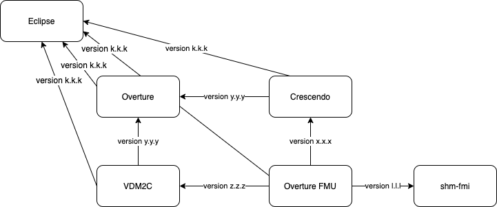

.. _tool_dependencies:

*****************
Tool Dependencies
*****************
:numref:`overturefmudependencies` shows how the dependencies between the Overture FMU and other Overture-based tools.

.. _overturefmudependencies:

    Dependencies of Overture FMU and its dependencies

Release
=======
When a new version of Overture is released, the Overture FMU must be updated accordingly. Specifically, the following must be carried out:

- Update VDM2C to a newer version of Overture (and possibly Eclipse)
- Update Crescendo to a newer version of Overture (and possibly Eclipse)
- Update the Overture FMU to a newer version by changing threee dependencies: one for Crescendo, one for VDM2C and possibly Eclipse
- The dependency for Overture must be the same for VDM2C and Crescendo.
- VDM2C and Crescendo MUST be released before the Overture FMU

See the release procedure at https://github.com/overturetool/overture-fmu/blob/development/readme.md

Relevant repositories:

- shm-fmi: https://github.com/overturetool/shm-fmi
- crescendo: https://github.com/crescendotool/crescendo
- vdm2c: https://github.com/overturetool/vdm2c
- Overture: https://github.com/overturetool/overture
